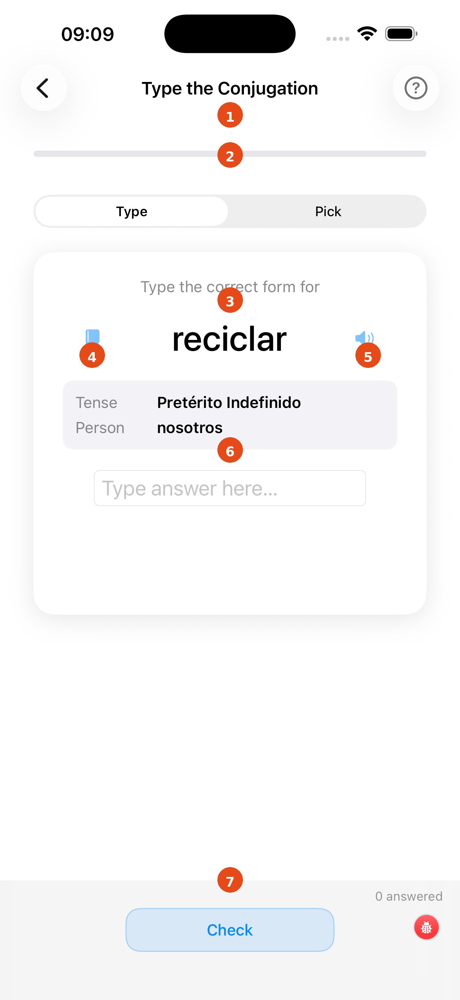
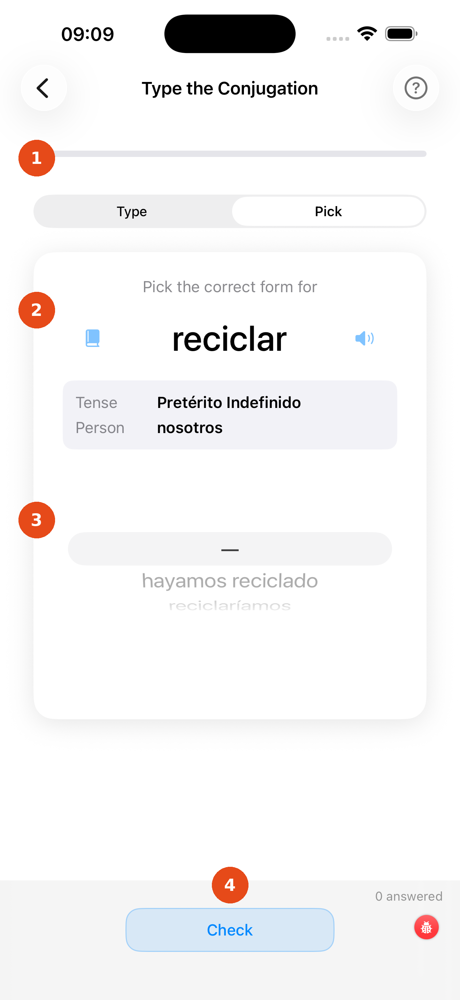

# Conjugation Drill

The Conjugation Drill presents a verb, tense, and person and asks you to produce the correct conjugated form. You can practise in two modes — **Type** (keyboard) or **Pick** (multiple choice) — switchable at any time.

---

## Type mode

1. **Progress bar** — green fill shows your correct-answer ratio for this session
2. **Type / Pick picker** — switch between the two practice modes at any time
3. **Question card** — shows the verb, tense, and a grammar note
4. **Book icon** — tap to open the full conjugation table for this verb (opens as a sheet)
5. **Speaker icon** — tap to hear the correct answer pronounced aloud
6. **Answer field** — the pronoun is shown on the left; type the conjugated form into the box
7. **Check / Next button** — tap **Check** to get instant feedback, then **Next →** to move on

After tapping Check, the app colours your input green (correct) or red (incorrect) and shows the right answer if you were wrong. Tap **Skip** to skip the current question without it counting against your score.

---

## Pick mode

1. **Type / Pick picker** — Pick mode is now active
2. **Question card** — same verb, tense, and pronoun information
3. **Multiple-choice options** — up to four plausible conjugations; tap the one you think is correct
4. **Check button** — confirms your selection and shows feedback

Pick mode is useful when you are learning new tenses and the keyboard input feels too difficult. Switch to Type mode once you feel confident.

!!! tip
    The multiple-choice distractors are phonetically similar to the correct answer, so you still have to think carefully — you cannot just spot the odd one out.

[← Back to Verbs Coach](verbs-coach.md){ .md-button }
[Next: Word Meanings Flashcard →](verb-meanings-test.md){ .md-button }
