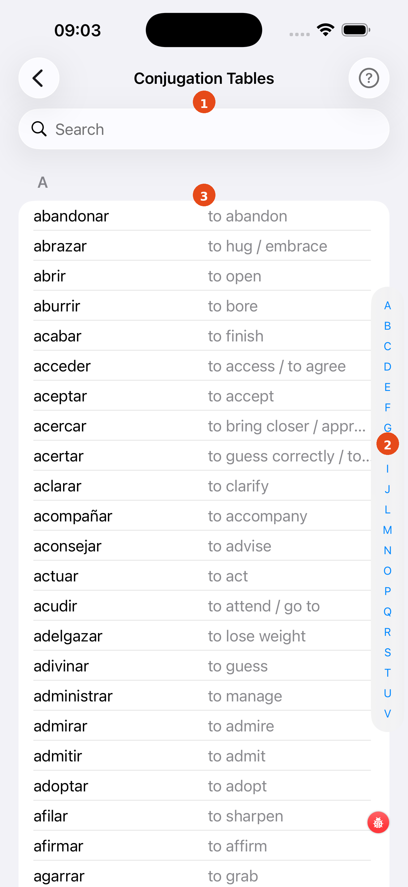
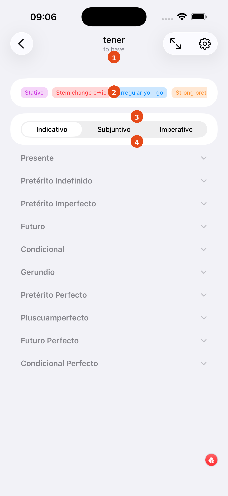
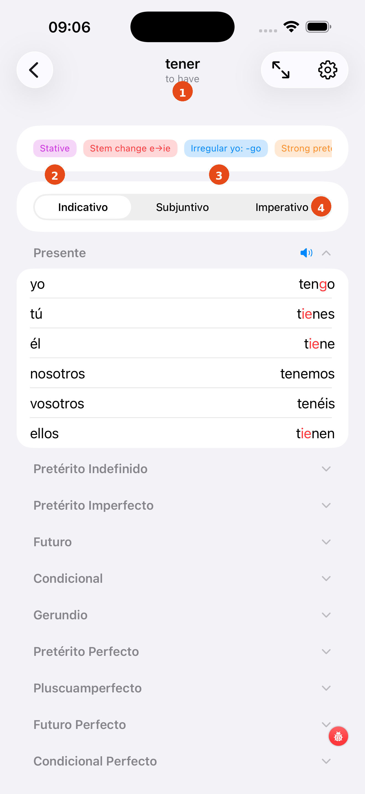
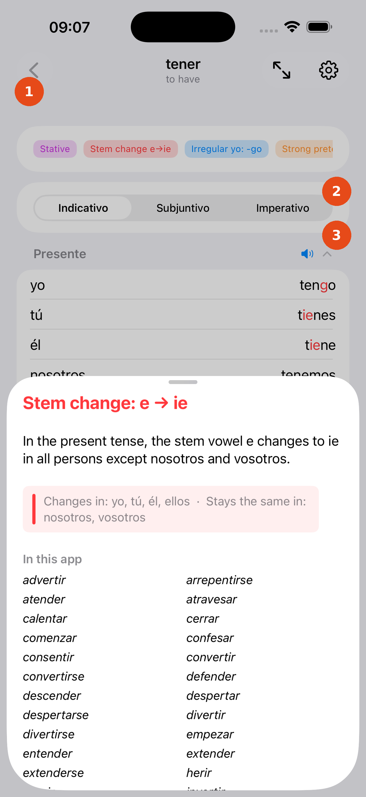

# Conjugation Tables

The Conjugation Tables browser lets you look up the full conjugation of any verb in your current selection — all tenses, all persons, with irregular forms highlighted.

---

## Verb list

1. **Search bar** — type any Spanish verb to filter the list instantly (diacritic-insensitive)
2. **Alphabetical index** — tap a letter on the right edge to jump directly to that section
3. **Verb row** — tap any verb to open its full conjugation table

---

## Full conjugation table

1. **Verb header** — shows the infinitive and its English translation
2. **Tense section** — each tense is a collapsible section; tap the header to expand or collapse it
3. **Irregular form** — shown in orange or red to draw your attention to the change
4. **Regular form** — shown in the default text colour

---

## Tense detail

1. **Tense title** — e.g. *Presente*, *Pretérito Indefinido*
2. **Pronoun column** — yo, tú, él/ella, nosotros, vosotros, ellos/ellas
3. **Conjugated form** — the full inflected word
4. **Orange highlight** — marks a stem change or irregular ending

---

## Colour coding

1. **Section header** — tap the `?` icon to read a grammar note on that tense group
2. **Red highlight** — entire word is irregular (no predictable pattern)
3. **Partial highlight** — only the changed portion is coloured; the regular ending is black

!!! note "Study tip"
    Use this screen alongside any test. When you get an answer wrong, tap the book icon on the test card to jump straight here and see the full table.

[← Back to Verbs Coach](verbs-coach.md){ .md-button }
[Next: Word Meanings →](word-meanings-study.md){ .md-button }
