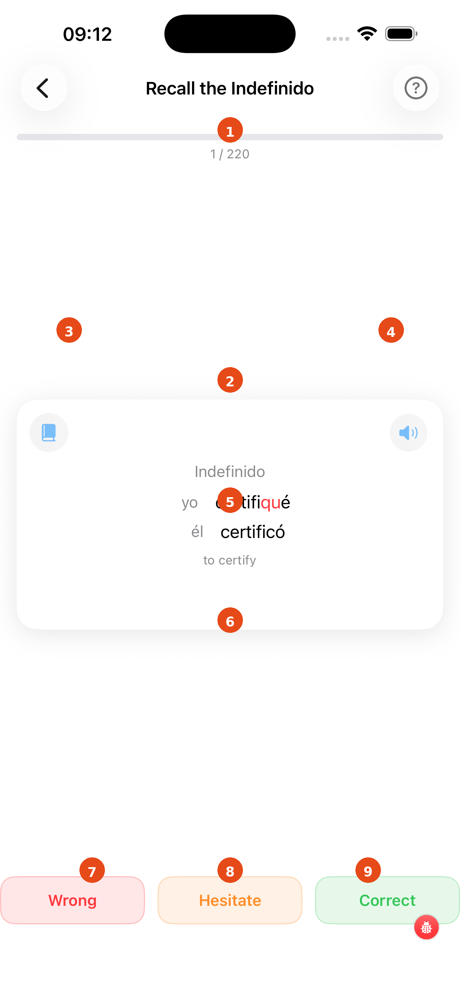

# Preterite Drill (Indefinido)

The Indefinido drill focuses on the simple past tense — specifically the **yo** and **él/ella** forms, which carry the most irregular patterns. The deck always includes all strong-preterite verbs in your selection (e.g. *tuve*, *vine*, *hice*).

---

1. **Progress bar** — advances card by card; the counter shows your position
2. **Card front** — shows "Indefinido of" and the infinitive; recall the yo and él forms before tapping
3. **Book icon** — opens the full conjugation table filtered to the Indefinido tense
4. **Speaker icon** — tap to hear the infinitive (front) or both preterite forms (back) in sequence
5. **"Tap to reveal"** — tap the card to flip it with a 3-D animation

### After flipping

The back shows the **yo** and **él** forms side by side. Irregular stem or ending changes are highlighted in orange. For example, *tener* → *tuve / tuvo* — the vowel completely changes. Rate yourself with the three buttons:

| Button | Colour | Use |
|---|---|---|
| **Wrong** | Red | Did not know either form |
| **Hesitate** | Orange | Got them but needed effort |
| **Correct** | Green | Recalled both immediately |

The card flashes the corresponding colour and then advances automatically.

!!! tip "Why yo and él?"
    In the Indefinido, yo and él often have the same irregular stem (*tuv-*), while other persons follow a more regular pattern. Mastering these two unlocks the whole tense.

[← Back to Verbs Coach](verbs-coach.md){ .md-button }
