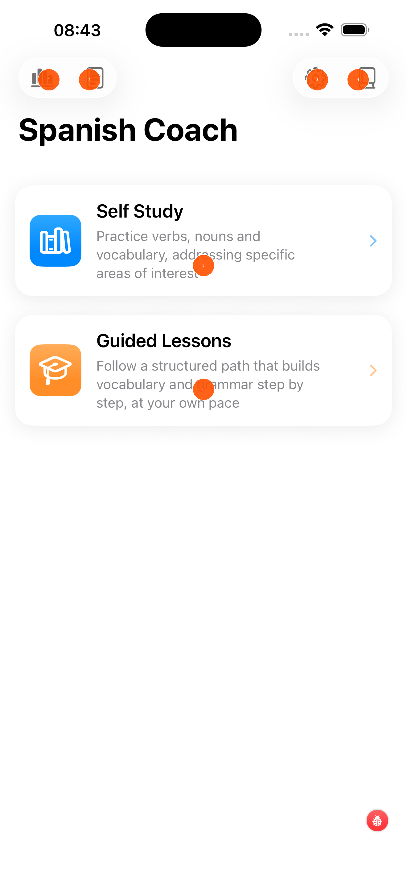

# Main Screen

When you open Spanish Coach you land on the main screen. From here you choose your learning path.

1. **Progress & statistics** — tap to see your learning history, streaks, and performance charts
2. **Learning history** — browse your past sessions and results
3. **Settings** — adjust app preferences, notifications, and account details
4. **Reference library** — quick access to reference material
5. **Self Study** — practice at your own pace; choose which verbs, nouns, or phrases to focus on. Tap to enter.
6. **Guided Lessons** — follow a structured path that builds vocabulary and grammar step by step. Tap to enter.

---

## Choosing a Path

| Path | Best for |
|---|---|
| **Self Study** | You know what you want to practise — specific verb tenses, topics, or vocabulary groups |
| **Guided Lessons** | You want a structured programme that decides what to study next for you |

[Next: Self Study →](self-study.md){ .md-button }
