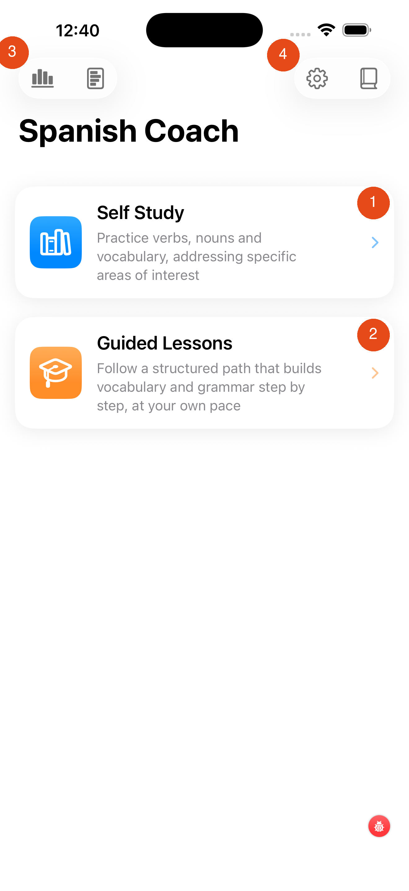

# Spanish Coach

When you open the app  you land on this main screen. From here you choose your learning path.

---

## Choosing a Path

| Path | Best for |
|---|---|
| **Self Study** | You know what you want to practise — specific verb tenses, topics, or vocabulary groups |
| **Guided Lessons** | You want a structured programme that decides what to study next for you |

At the top of the screen you see icons, on the right to change user setttings and to diplay online help, on the left icon(s) to review leaning performance data.

[Next: Self Study →](self-study.md){ .md-button }
