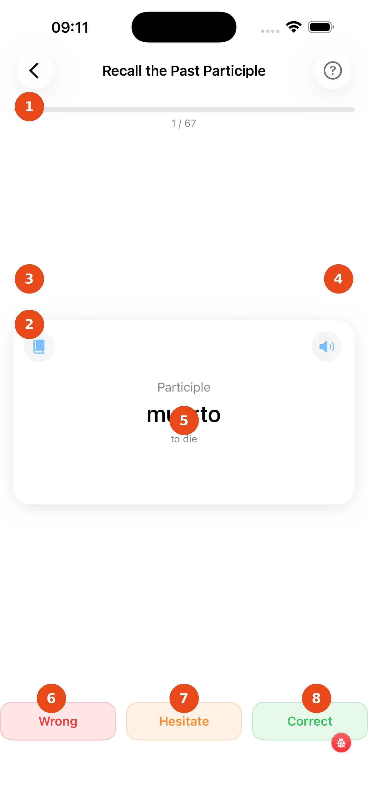

# Past Participle Drill

The Past Participle drill trains you to recall the participio of Spanish verbs — the form used in compound tenses like the perfect (*he hablado*) and as an adjective (*la puerta cerrada*). The deck prioritises irregular participles (e.g. *hecho*, *visto*, *puesto*).

---

1. **Progress bar** — shows how far through the deck you are; the counter (e.g. 2 / 18) is shown below
2. **Card front** — shows "Participle of" and the infinitive; think of the participio before tapping
3. **Book icon** — tap to open the full conjugation table for this verb
4. **Speaker icon** — tap to hear the infinitive (front) or the participio (back) pronounced
5. **"Tap to reveal"** — tap the card anywhere to flip it with a 3-D animation

### After flipping

The back shows the participio. Irregular forms are shown in orange text. Tap the card again at any time to flip it back if you want to compare front and back. Then rate yourself:

| Button | Colour | Use |
|---|---|---|
| **Wrong** | Red | Did not recall the form |
| **Hesitate** | Orange | Recalled it, but slowly |
| **Correct** | Green | Recalled it immediately |

The card flashes the corresponding colour before advancing automatically.

!!! note "Deck composition"
    The drill always includes all irregular participles from your verb selection, plus roughly half as many regular participles to keep your ear calibrated.

[← Back to Verbs Coach](verbs-coach.md){ .md-button }
[Next: Preterite (Indefinido) →](indefinido.md){ .md-button }
