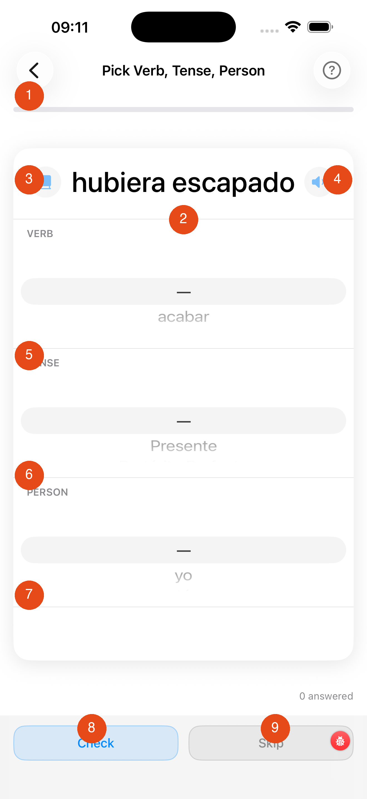

# Recognition

The Recognition drill shows you a conjugated verb form and asks you to identify which verb it belongs to, which tense it is, and who the subject is — using three scroll wheels.

---

1. **Progress bar** — green fill = correct answers ÷ total answered this session
2. **Conjugated form** — the word you must identify; shown in large type
3. **Book icon** — tap to open the full conjugation table for the correct verb (available after checking)
4. **Speaker icon** — tap to hear the form pronounced
5. **VERB wheel** — scroll to the verb you think this form belongs to; the correct verb plus up to 14 phonetically similar distractors are included
6. **TENSE wheel** — scroll to the tense (Present, Preterite, Imperfect, …)
7. **PERSON wheel** — scroll to the grammatical person (yo, tú, él/ella, …)
8. **Check button** — submit your three-part answer; the app shows whether you are correct and, if not, lists all valid answers (some forms are identical across multiple tenses or persons)
9. **Skip button** — move to the next question without it affecting your score

!!! note "Ambiguous forms"
    Some conjugated forms are shared by more than one person or tense (e.g. *habló* = él habló / ellos hablaron). If your answer is correct for any valid combination, the app marks it right and shows the other valid answers.

[← Back to Verbs Coach](verbs-coach.md){ .md-button }
[Next: Gerund (Gerundio) →](gerundio.md){ .md-button }
