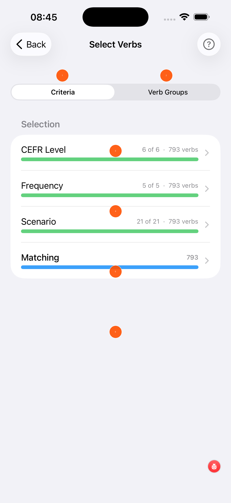
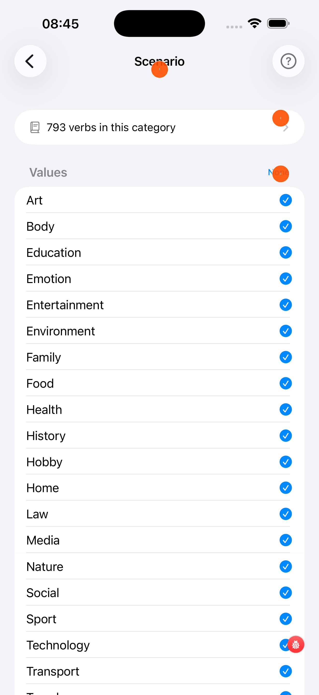
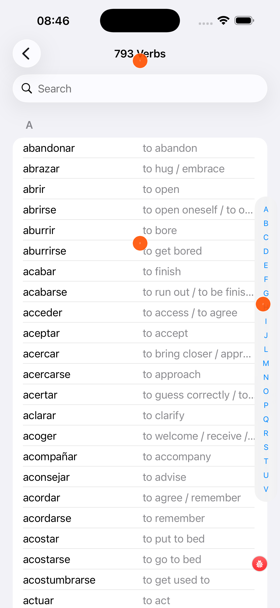

# Selecting Verbs

Spanish Coach includes nearly 800 Spanish verbs. The Select Verbs screen lets you narrow these down to exactly the set you want to practise.

---

## Criteria tab

Use the Criteria tab to filter verbs by difficulty, frequency, and topic.

1. **Criteria tab** — filter by CEFR level, frequency, and scenario (active tab)
2. **Verb Groups tab** — select verbs by named groups instead of criteria
3. **CEFR Level** — tap to choose which CEFR levels to include (A1, A2, B1, B2, C1, C2). The green bar shows how many levels are selected.
4. **Frequency** — tap to include only the most commonly used verbs (1 = most common, 5 = all)
5. **Scenario** — tap to filter by topic (e.g. Food, Travel, Health). [See scenarios →](#scenario-selection)
6. **Matching** — shows how many verbs currently match all your filters combined. The blue bar is your working set.

!!! tip "Start small"
    For beginners, try CEFR A1+A2, Frequency 1–2, and one or two scenarios. This gives you a focused set of 30–60 high-priority verbs.

---

## Scenario selection

1. **Verb count** — shows how many verbs are in this scenario category
2. **None** — tap to deselect all scenarios at once
3. **Checkboxes** — tap any scenario to toggle it on (blue tick) or off. Selecting more scenarios adds more verbs to your practice set.

Available scenarios include: Art, Body, Education, Emotion, Entertainment, Environment, Family, Food, Health, History, Hobby, Home, Law, Media, Nature, Social, Sport, Technology, Transport, and more.

---

## Verb list

1. **Search** — type any Spanish or English word to filter the list instantly
2. **Alphabetical index** — tap a letter on the right edge to jump directly to that section of the list
3. **Verb list** — shows all verbs matching your current criteria with their English translation. Tap any verb to see its full details.

[Back to Verbs Coach ←](verbs-coach.md){ .md-button }
