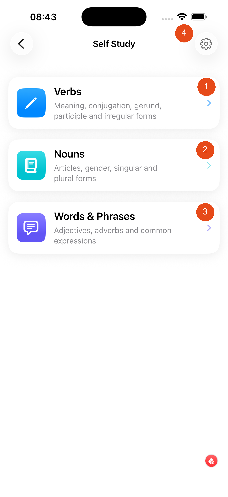

# Self Study

The Self Study screen lets you choose what type of vocabulary or grammar you want to practise.

1. **Verbs** — practise verb meanings, conjugation, gerund, participle, and irregular forms. [Learn more →](../verbs-coach/)
2. **Nouns** — practise articles, gender, singular and plural forms
3. **Words & Phrases** — practise adjectives, adverbs, and common expressions
4. **Settings** — app and session preferences

---

## What's in each section?

**Verbs** is the most comprehensive section — it includes a full setup system for filtering which verbs and tenses you practise, plus six different test types. See the [Verbs Coach](../verbs-coach/) page for details.

**Nouns** and **Words & Phrases** follow a similar structure: select the words you want to study, then test yourself.

[Next: Verbs Coach →](../verbs-coach/){ .md-button }
