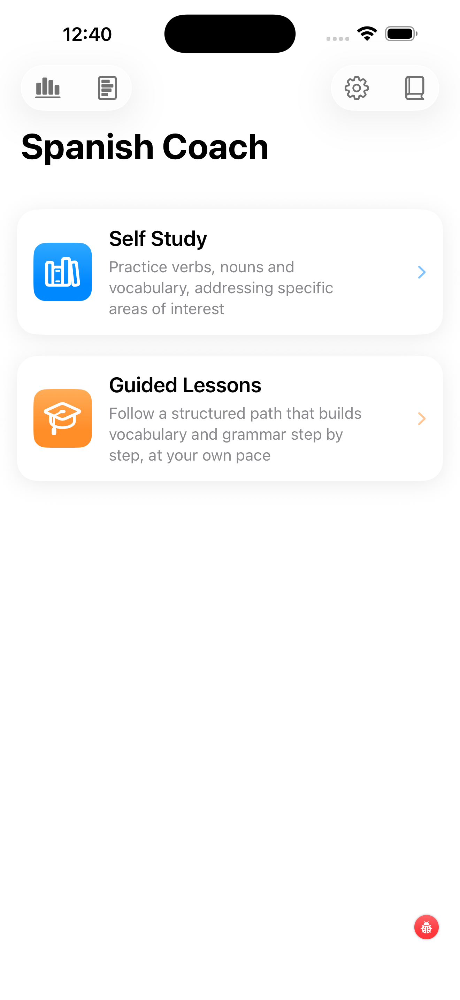

# Spanish Coach

When you open the app, you land on this main screen. From here you choose your learning path and reach the global tools.

---

## Choosing a learning path

Two large buttons dominate the screen:

- **Self Study** — for when you know what you want to practise. You decide which verbs, nouns, and tenses to work on, and which test type to run. This is the right entry point for most learners most of the time. See [Self Study](../self-study/).
- **Guided Lessons** — a structured curriculum that decides what's next for you. Lessons are CEFR-tagged and must be completed in order; each unlocks the next. See [Guided Lessons](../guided-lessons/).

Both paths share the same underlying vocabulary database and adaptive engine — your progress in Self Study carries over to Guided Lessons and vice versa.

---

## Icons along the top

**Right side** — global tools.

- **Settings** (the gear icon) — open the global preferences screen: interface and native language, session size, learning pace, speech, dictionary services, and data management. See the [Settings page](../settings/) for everything that lives behind this icon.
- **Help / User Guide** — opens the in-app help, which mirrors what you're reading right now.

**Left side** — your performance.

- A small chart icon opens an overview of your study history: total words practised, accuracy by section, your **weakest words** (those you keep getting wrong) and **strongest words** (consistently correct). Useful for spotting patterns and deciding what to put more time into.

---

## UI conventions used throughout the app

!!! tip "Tap vs long-press"
    In most screens of the app, a quick **tap** triggers an action — start a session, flip a card, open a detail view. A **long-press** on a control gives you a short explanation of what that control does. If you're ever unsure what a button means, long-press it before tapping.

!!! info "Detail views are tappable"
    Many screens show words in a list or card form. Tapping a word almost always opens its **detail view** — translation, forms, level, frequency, topics, example sentences, and external dictionary lookup chips. Use it whenever a quick look would help you make sense of a word.

---

## What happens on first launch

The first time you open Spanish Coach, all filters are wide open: every word, every tense, every topic. You can start a test immediately, but you'll get more out of the app if you spend a minute in **Self Study → Setup** narrowing the pool to material at your level. The app remembers your choices, so you only do this once.
