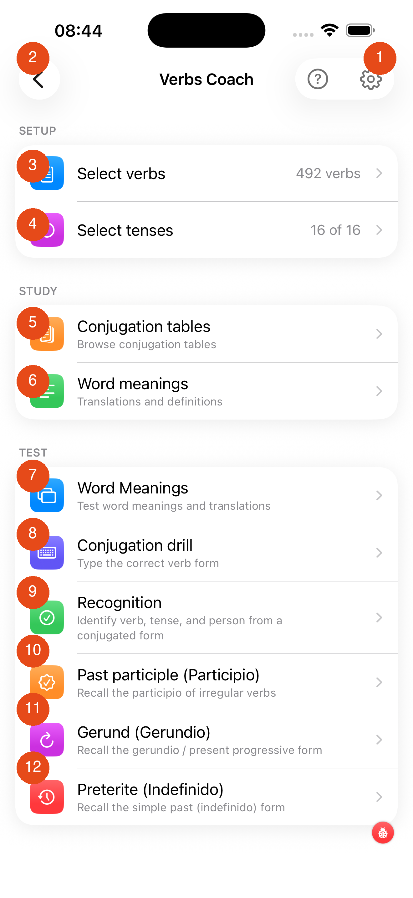

# Verbs Coach

The Verbs Coach screen is your control centre for verb practice. It's divided into three sections: **Setup**, **Study**, and **Test**.

1. **Help** — tap the ? icon for a quick explanation of each test type
2. **Settings** — adjust session length and other preferences

### Setup

3. **Select verbs** — choose which verbs to include in your practice. Shows the current count (e.g. "492 verbs"). [Learn more →](select-verbs.md)
4. **Select tenses** — choose which tenses to practise (e.g. "16 of 16"). Tap to include or exclude specific tenses.

### Study

5. **Conjugation tables** — browse the full conjugation table for any verb; useful for reference and checking your answers
6. **Word meanings** — look up translations and definitions without being tested

### Test

7. **Word Meanings** — you see a verb and must choose or type the correct translation
8. **Conjugation drill** — you see a verb and tense and must type the correct conjugated form
9. **Recognition** — you see a conjugated form and must identify the verb, tense, and person
10. **Past participle (Participio)** — you must recall the past participle of irregular verbs
11. **Gerund (Gerundio)** — you must recall the gerund / present progressive form
12. **Preterite (Indefinido)** — you must recall the simple past (indefinido) form

---

## Where each tap takes you

Every row on the Verbs Coach screen is a navigation link. Here is the complete map of which tap leads to which screen:

| Tap | Opens |
|---|---|
| **Select verbs** | [Selecting Verbs](select-verbs.md) — filter by CEFR, frequency, topic, or verb group |
| **Select tenses** | [Selecting Tenses](select-tenses.md) — toggle individual tenses on/off by group |
| **Conjugation** (Study) | [Conjugation Tables](conjugation-tables.md) — browse full tables; tap any verb |
| **Word meanings** (Study) | [Word Meanings](word-meanings-study.md) — browse translations; no testing |
| **Conjugation** (Test) | [Conjugation Drill](conjugation-drill.md) — type or pick the correct verb form |
| **Word Meanings** (Test) | [Word Meanings Flashcard](verb-meanings-test.md) — flip cards; self-rate Wrong/Hesitate/Correct |
| **Recognition** | [Recognition](recognition.md) — see a conjugated form; identify verb, tense, and person |
| **Past participle** | [Past Participle](past-participle.md) — flashcard drill for participios |
| **Gerund** | [Gerund (Gerundio)](gerundio.md) — flashcard drill for gerundios |
| **Preterite** | [Preterite (Indefinido)](indefinido.md) — flashcard drill for indefinido yo/él forms |

---

## Recommended workflow

1. Start with **Select verbs** to choose a manageable set (50–100 verbs is a good starting point)
2. Use **Select tenses** to focus on the tenses you're currently learning
3. Warm up with **Word Meanings** (Study) to make sure you know the verbs
4. Progress to **Conjugation Drill** and **Recognition** for deeper practice
5. Use the **Participle**, **Gerundio**, and **Indefinido** drills to master the most common irregular forms

[Next: Selecting Verbs →](select-verbs.md){ .md-button }
