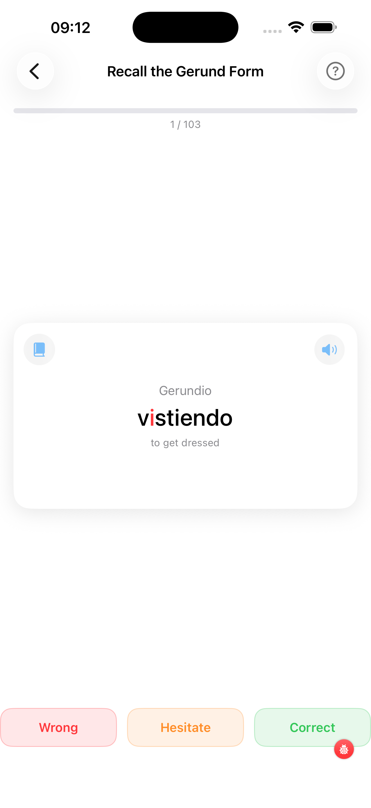

# Gerund Drill (Gerundio)

The Gerundio drill trains you to recall the present-participle form of Spanish verbs (e.g. *hablando*, *teniendo*, *yendo*). The deck always includes all irregular gerundios in your selection, plus a sample of regular ones.

---

1. **Progress bar** — advances as you work through the deck; the counter shows your position (e.g. 3 / 24)
2. **Card front** — shows "Gerundio of" followed by the infinitive; think of the gerundio before tapping
3. **Book icon** — opens the full conjugation table for this verb as a sheet
4. **Speaker icon** — tap to hear the infinitive (front) or the gerundio (back) pronounced
5. **"Tap to reveal"** — tap the card to flip it; it animates with a 3-D spin

### After flipping

The back of the card shows the gerundio. Irregular changes are highlighted in red or orange — for example the stem vowel change in *durmiendo* (from *dormir*). Three response buttons appear:

| Button | Colour | Use |
|---|---|---|
| **Wrong** | Red | You did not remember the form |
| **Hesitate** | Orange | You got it but needed a moment |
| **Correct** | Green | You recalled it immediately |

After you tap a button, the card briefly flashes the corresponding colour before advancing to the next card automatically. At the end of the deck a summary shows correct vs. wrong counts and a **Drill Again** button.

[← Back to Verbs Coach](../){ .md-button }
[Next: Past Participle →](../past-participle/){ .md-button }
