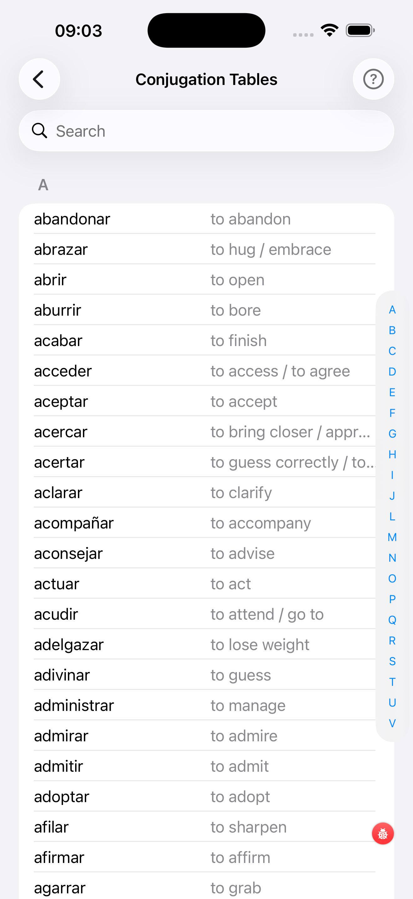
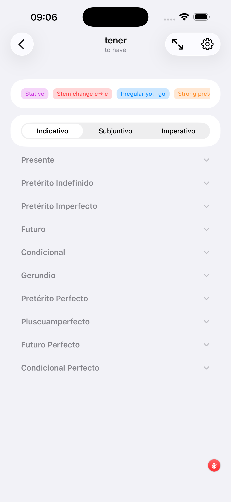
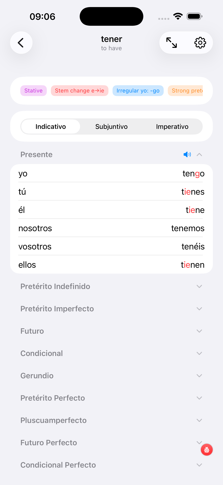
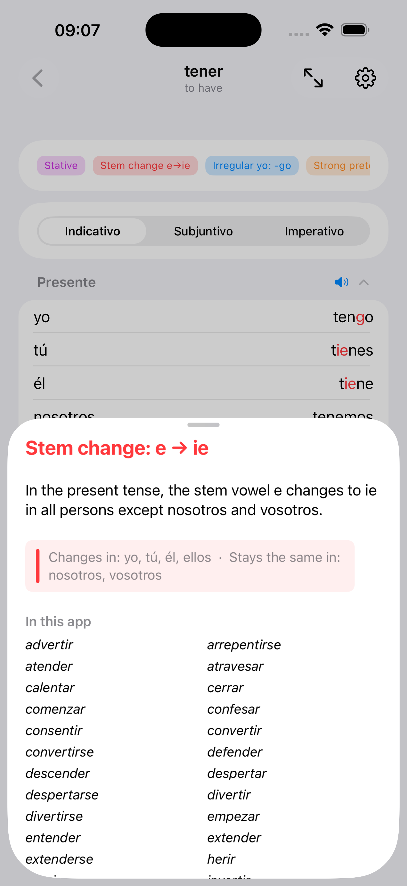

# Conjugation Tables

The Conjugation Tables browser lets you look up the full conjugation of any verb in your current selection — all tenses, all persons, with irregular forms highlighted.

<strong>Verb list</strong>

Search and alphabetical index. Tap a verb to open its table.

<strong>Full table</strong>

All tenses for one verb, each as a collapsible section.

<strong>Tense detail</strong>

One tense expanded — pronouns and conjugated forms side by side.

<strong>Colour coding</strong>

Irregular forms marked in red so you can see exactly what deviates.

---

## How to use it

Open the **Verb list**, search or scroll to the verb you want, and tap it. The **Full table** appears with one section per tense — tap a section header to expand it. Tap the `?` icon next to a tense group to read a grammar note.

Each conjugated form is shown plain for **regular** forms and in **red** when something is irregular. Only the part of the word that actually deviates from the regular pattern is in red — the rest stays in the default text colour. When the entire form is in red, the whole word is irregular (think *ser*, *ir*, *haber*) and has to be memorised as a whole. This colour coding makes it easy to spot stem changes, irregular *yo* forms, irregular future stems, and the strong-preterite patterns at a glance.

!!! note "Study tip"
    Use this screen alongside any test. When you get an answer wrong, tap the book icon on the test card to jump straight here and see the full table.
