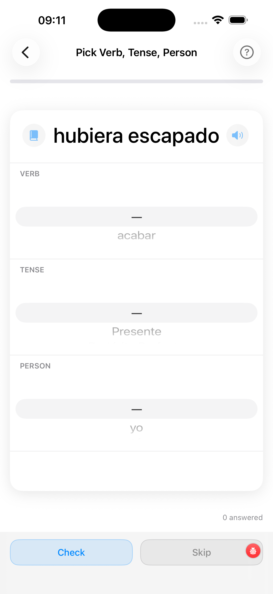

# Recognition

The Recognition drill shows you a conjugated verb form and asks you to identify which verb it belongs to, which tense it is, and who the subject is — using three scroll wheels. It's the inverse of the Conjugation Drill: there you produce a form, here you decode one.

---

1. **Progress bar** — green fill = correct answers ÷ total answered this session
2. **Conjugated form** — the word you must identify; shown in large type
3. **Book icon** — tap to open the full conjugation table for the correct verb (available after checking)
4. **Speaker icon** — tap to hear the form pronounced
5. **VERB wheel** — scroll to the verb you think this form belongs to; the correct verb plus up to 14 phonetically similar distractors are included
6. **TENSE wheel** — scroll to the tense (Present, Preterite, Imperfect, …)
7. **PERSON wheel** — scroll to the grammatical person (yo, tú, él/ella, …)
8. **Check button** — submit your three-part answer; the app shows whether you are correct and, if not, lists all valid answers (some forms are identical across multiple tenses or persons)
9. **Skip button** — move to the next question without it affecting your score

---

## How the three wheels work together

All three wheels must be correct for the answer to count as right. The app picks distractors carefully:

- The **VERB** wheel includes the correct verb plus phonetically similar verbs from your selection — easy to slip up if you're not paying attention to the stem.
- The **TENSE** wheel includes only tenses you've enabled in [Selecting Tenses](../select-tenses/).
- The **PERSON** wheel covers all six persons (yo, tú, él/ella, nosotros, vosotros, ellos).

---

## Ambiguous forms

!!! note "Forms shared by multiple tenses or persons"
    Some conjugated forms are shared by more than one combination. For example, *habló* is the third-person singular preterite of *hablar*, but *hablo* (no accent) is the first-person singular present of the same verb. If your answer is valid for *any* combination that produces this form, the app marks it right and shows the other valid answers in the explanation panel.

This is also why a form like *vivimos* (which is identical in present and preterite for *vivir*) is fair: you only need to pick one of the valid persons/tenses to score the point.

---

## When to use Recognition

Recognition is the right drill when:

- You can produce common forms but stumble when *reading* them — typical when you've spent more time on conjugation tables than on real Spanish text.
- You want to test your *ear* for tense without an English prompt giving the game away.
- You're approaching a reading or listening exam and need to decode forms fast.

If you're early in a tense's learning curve and find Recognition too hard, run the [Conjugation Drill](../conjugation-drill/) in Pick mode first until producing the forms is reliable, then come back here.

---

## Scoring and adaptation

Every answer feeds the local performance database. The adaptive engine prioritises verbs you keep mis-recognising, so the next session leans heavier on your weak spots.
