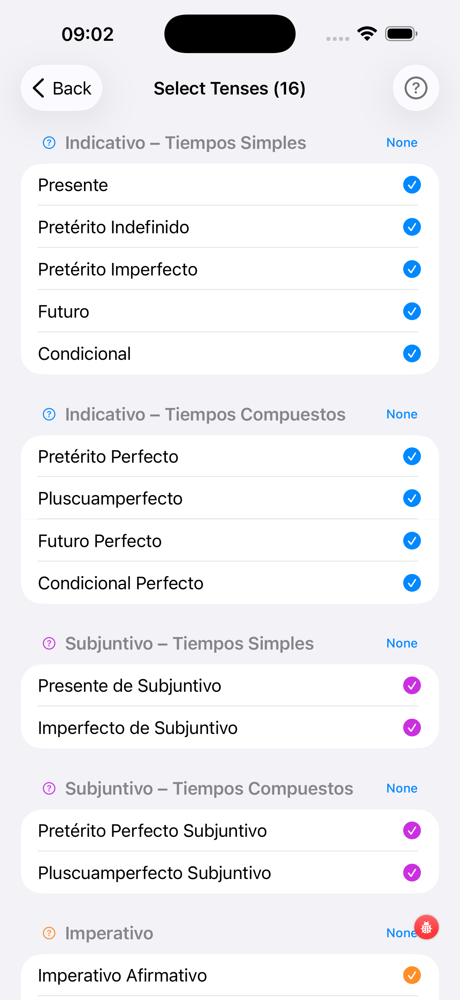

# Selecting Tenses

The Select Tenses screen lets you choose which tenses are included in all study and test sessions. Tenses are grouped into six categories.

---

1. **Group info button** — tap the `?` next to a group heading to read a full grammar explanation of that tense group (opens a sheet in your language)
2. **All / None toggle** — tap to select or deselect every tense in this group at once
3. **Selected tense** — blue filled circle means this tense is active in exercises
4. **Unselected tense** — empty circle; tap the row to activate it
5. **Swipe left for detail** — swipe any tense row to reveal an Info button that opens a grammar explanation for that specific tense

The title bar always shows the current count (e.g. **Select Tenses (16)**) so you know how many tenses are active.

### Tense groups

Tenses are organised into six groups:

- **Indicativo – Simples** — Present, Imperfect, Preterite, Future, Conditional.
- **Indicativo – Compuestos** — Perfect, Pluperfect, Future Perfect, Conditional Perfect.
- **Subjuntivo – Simples** — Present Subjunctive, Imperfect Subjunctive.
- **Subjuntivo – Compuestos** — Present Perfect and Pluperfect Subjunctive.
- **Imperativo** — affirmative and negative command forms.
- **Formas no Personales** — Infinitive, Gerundio, Past Participle.

!!! tip "Beginner tip"
    Start with just the **Indicativo – Simples** group. Master those five tenses before adding the subjunctive or compound tenses.
