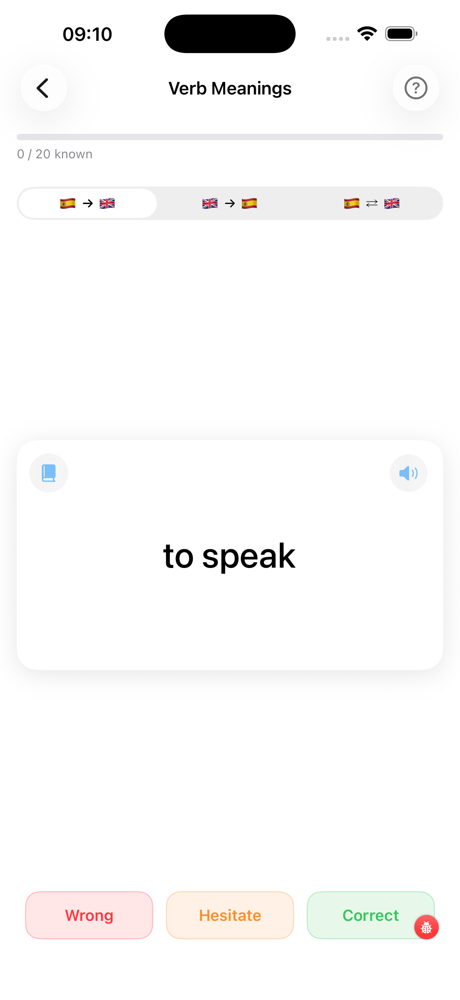

# Word Meanings Flashcard

The Word Meanings flashcard test presents Spanish verbs (or their English translations) and asks you to recall the other side. You rate yourself after each card — **Correct**, **Difficult**, or **Incorrect** — and the app tracks your progress.

---

1. **Direction picker** — choose how cards are presented:
    - *Spanish → Translation*: you see the Spanish verb and recall the English meaning
    - *Translation → Spanish*: you see the English meaning and recall the Spanish verb
    - *Mixed*: both directions appear randomly
2. **Progress bar** — fills as you work through the deck; green = correct ratio
3. **Card face** — shows the Spanish verb (or translation, depending on direction)
4. **Book icon** — tap to open the full conjugation table for this verb without leaving the test
5. **Speaker icon** — tap to hear the Spanish verb (or answer) pronounced
6. **"Tap to reveal"** — the card does not flip automatically; tap it to see the answer

!!! tip "Need context, not just translation?"
    Tap the verb (the bold word, not the card body) to open its detail view — gerundio, participio, level/frequency/topic chips, and an **Examples card** with three Spanish sentences plus translations. Helpful when you can't quite recall the meaning and want a usage hint before flipping the card.

### After flipping

Once you tap the card it flips with a 3-D animation to reveal the answer. Three response buttons appear at the bottom:

| Button | Meaning |
|---|---|
| **Correct** (green) | You knew it without hesitation |
| **Difficult** (orange) | You got there eventually, or were only partially right |
| **Incorrect** (red) | You did not know the answer or were wrong |

Every answer is recorded in the local performance database and feeds the adaptive engine, which prioritises weaker verbs in future sessions.

At the end of the deck, a summary screen shows your Correct / Difficult / Incorrect counts and lets you start a new session.
