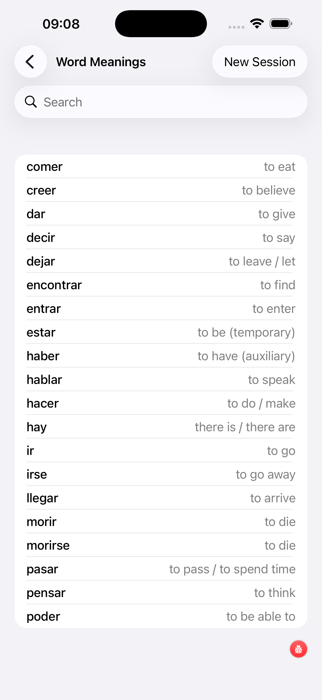

# Word Meanings (Study)

The Word Meanings study screen is a browse-only reference: no testing, no timers, nothing recorded. Use it to review translations before a session, or to look up a verb you encountered in a test.

---

1. **Search bar** — type Spanish or English to filter the list instantly
2. **New Session** — reshuffles the word pool so you see a fresh set drawn from your selected verbs (the pool respects your session size setting)
3. **Spanish verb** — shown in bold on the left
4. **Translation** — shown in the secondary colour on the right

---

## What the list shows

The list contains the verbs selected for your **current session**, not your entire selection. This keeps it focused: if your session size is 30 and you've narrowed the filter to *A2 + Travel*, you see those 30 here.

If you want to browse *all* selected verbs at once, use the [Conjugation Tables](../conjugation-tables/) screen — its scrollable index lists every verb in your selection regardless of session boundaries.

---

## Opening a verb's detail view

Tap any verb to open its detail view. You'll see:

- **Gerundio** and **Participio** with an *irregular* badge where relevant
- A **Group** chip (regular, stem-changing, go-verb, …) plus **Level**, **Frequency**, and **Topics**
- An **Examples card** with three Spanish sentences plus translations in your selected display language — useful for seeing how the verb is actually used
- A **Look up** row with chip buttons for external dictionaries (Linguee, WordReference, Reverso, RAE) — pick the ones you want to use in [Settings → Dictionary Services](../../settings/#dictionary-services)

Tapping outside the sheet returns you to the list with your position preserved.

---

## When to use Study vs the flashcard tests

- **Word Meanings (Study)** — this screen. Browse-only; nothing recorded. Use it for a quick warm-up before a test, or to dig into a verb you keep mis-translating.
- [**Word Meanings Flashcard**](../verb-meanings-test/) — active drill, every answer recorded. Use it when you want the adaptive engine to track and prioritise your weak verbs.

A typical loop is: peek at Study for a minute to reactivate the vocabulary, then run the Flashcard test on the same selection.
