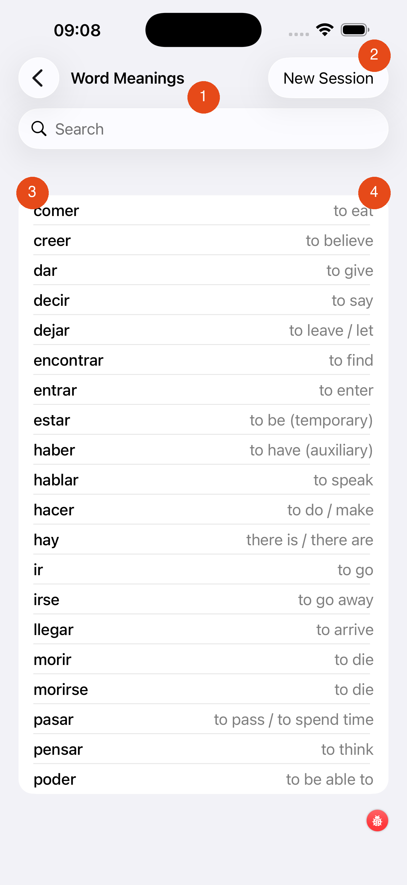

# Word Meanings (Study)

The Word Meanings study screen is a browse-only reference: no testing, no timers. Use it to review translations before a session, or to look up a word you encountered in a test.

---

1. **Search bar** — type Spanish or English to filter the list instantly
2. **New Session** — reshuffles the word pool so you see a fresh set drawn from your selected verbs (the pool respects your session size setting)
3. **Spanish verb** — shown in bold on the left
4. **Translation** — shown in the secondary colour on the right

The list shows the verbs selected for your current session, not your entire selection. If you want to browse all selected verbs, use the [Conjugation Tables](conjugation-tables.md) screen instead.

[← Back to Verbs Coach](verbs-coach.md){ .md-button }
[Next: Conjugation Drill →](conjugation-drill.md){ .md-button }
